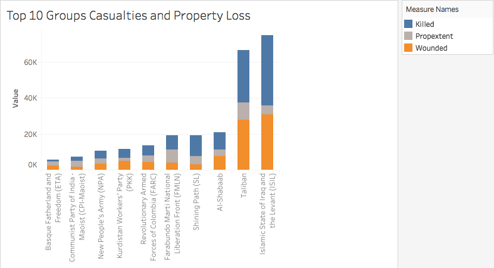

# Global-Terrorism-Database-Visualisation
## Overview
The data set was the publically available and titled as “Global Terrorism Database.” The
data set was downloaded at the URL, https://www.kaggle.com/START-UMD/gtd, from the
Kaggle website. 

It recorded terrorist attacks around the world between 1970 and 2017 with the
1993 year’s data excluded. The raw data was sourced from unclassified media articles. 

The dataset was exposed to changes overtime due to the changing accessibility to the media.
There are 181,691 Terrorist Attacks on record in this data set. Each row of the table represents an
attack. The columns of the table describe 135 variables, including location, date, weapon
information, attack type, perpetrator, target, casualties, consequences, source citation etc.

## Visualisation of the Database of terrorist attacks worldwide, 1970-2017
### Active regions of Top 10 terrorist organizations

It can be seen that for several famous groups e.g. Taliban and ISIL, their target regions are
quite fixed: Taliban launched attacks in Afghanistan and Pakistan, while ISIL attacked mostly in
Iraq. However, for groups which are not active now and less-famous (e.g. SL, IRA and FMLN)
we can only find where they once launched attacks (South America, Central America) but cannot
figure out the time they launched.

### Casualties and Property Loss caused by Top 10 terrorists Groups

This graph shows the casualties and property loss caused by top 10 terrorist groups.
The gray part is the total number of attacks which caused major property loss (>1 million
and <1 billion USD), while the blue and orange part represent the total number of people killed
and wounded by this group respectively. We can see that Taliban and ISIL killed the most people.
Besides Taliban, groups like FMLN, SL also launch a considerable number of attacks which
caused big property loss. There is a consideration that FMLN and SL were revolutionaries which
mainly launched attacks on military and government’s stuff. Therefore, it might be much easy to
evaluate the property loss.

### The attack success rate of TOP10 terrorist groups

This is a bar chart that demonstrate the success rate of terrorist attacks of top 10 most
frequently attack terrorist groups. The top chart shows the number of attacks against top 10
groups while the bottom chart shows the percentage of attacks against top 10 groups.
It can be easily interpreted that from the bottom plots, Boko Haram and Farabundo Martí
National Liberation Front(FMLN) have the top 2 highest success rates in terms of percentages,
92.93% and 98.99% respectively. On the other hand, there are some groups that achieve a
comparatively low success rate that < 90%, for instance, Islamic State of Iraq and the Levant
(ISIL) and Taliban achieve only 84.79% and 89.33% respectively.
An interesting insight is that a higher success rate may not directly interpret that a group
must have causes higher number of successful attack in terms of counting on numbers. Take the
previously mentioned Islamic State of Iraq and the Levant(ISIL) and Taliban as examples,
although they have comparatively low success rate, both <90% from the bottom plots, but at the
same time they are the groups that contributes most successful attacks in terms of numbers,
4,759 and 6,680 successful number of attacks. While Boko Haram and Farabundo Martí National
Liberation Front (FMLN), who achieve the highest success rate in terms of percentages,
contribute only 2,247 and 3,317 successful number of attacks.

### Preferred target type of TOP10 terrorist groups

The pie chart is divided in 21 parts according to different attack target types. It is obvious
that military, private citizens or property and police enjoy the leading position. Business,
government and utilities also occupy noticeable proportion. From this chart, we can draw a
conclusion: the main target of terrorist attacks is the departments involved in national security, or
public places with large population flow and relatively weak protection.

### Preferred attack type of TOP10 terrorist groups

This bar chart illustrates the popularity of various attack types. Both the height of the bar
and the gradient of the color represent the number of records, the higher the bar and the darker
the color represent the attack type is used more. From the figure, we can see that the top 10
terrorist groups prefer to use the attack type by bombing, followed by armed assault, which also
have a certain number that cannot be ignored. Relatively speaking, hijacking and unarmed
assault are seldom adopted, maybe we can reduce attention on these parts.

### Word cloud of motive of TOP 10 terrorist group

This is a Word Cloud that illustrates terrorism activity motivation behind top 10 most
frequently attack groups from 1970-2017.
By quickly perceiving the most prominent terms by font size, there are few meaningful
words that standing out from the rest. For instance, civilian, rebel, assassination, people,
government, military. Connecting the words together, it could be interpreted that those top 10
13
most frequently attack groups are mostly the Rebels against government and many of them could
be Shabaab, known as "The Youth" or "The Youngsters".
This makes sense since the most well-known terrorist groups such as ISIL are Rebels that
intend to overthrow the current government and regime and they also has quite a bit of divisions
that are consisted of Shabaab, the army of youth and even so they are trained well enough to be
capable of achieving successful
